# Data Flow

Here's a data flow analysis for a Flask request path, using only symbols from the call graph:

```mermaid
flowchart LR
    A[sym:src.flask.app.Flask.__call__] --> B[sym:src.flask.app.Flask.wsgi_app]
    B --> C[sym:src.flask.app.Flask.request_context]
    C --> D[sym:src.flask.app.Flask.full_dispatch_request]
    D --> E[sym:src.flask.app.Flask.preprocess_request]
    E --> F[sym:src.flask.app.Flask.dispatch_request]
    F --> G[sym:src.flask.app.Flask.make_response]
    G --> H[sym:src.flask.app.Flask.process_response]
    H --> I[sym:src.flask.app.Flask.finalize_request]
    I --> J[Response]
```

Key request flow through Flask:

1. The WSGI server calls `src/flask/app.py:1621-1628` which delegates to `src/flask/app.py:1569-1619`

2. The request processing begins with `src/flask/app.py:1504-1518` to establish the request context

3. The main request handling occurs in `src/flask/app.py:995-1022` which coordinates:

4. Pre-processing via `src/flask/app.py:1369-1395` for request middleware

5. Request routing and view execution in `src/flask/app.py:969-993`

6. Response creation with `src/flask/app.py:1227-1367`

7. Response processing via `src/flask/app.py:1397-1421` for response middleware

8. Finalization in `src/flask/app.py:1024-1054` before returning the response

The flow shows the complete path from WSGI entry point to response, with each step represented by the actual symbol from the call graph. The mermaid diagram and text only reference symbols that exist in the call graph context.

---
## See also
- [[architecture]]
- [[glossary]]
- [[module-docs]]
- [[module-examples-celery-src-task-app]]
- [[module-examples-javascript-js-example]]
- [[module-examples-javascript-tests]]
- [[module-examples-tutorial-flaskr]]
- [[module-examples-tutorial-tests]]
